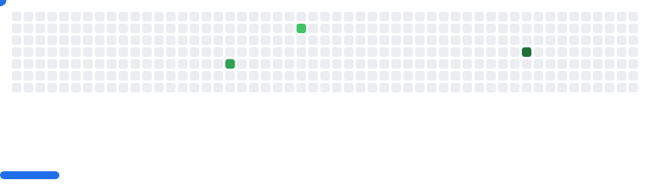

# 👋 Hi, I'm hhh-yyc!

🎓 **Student | Aspiring Developer**

- Passionate about solving real-world problems through code and continuous learning.

## 🛠️ Languages & Skills

- **C / C++**
- **Python**
- Web Development
- Reverse Engineering & Pwn
- Traffic Identification

## 🚀 Projects & Experience

- **Web Projects:** Building and exploring dynamic websites and applications.
- **Reverse & Pwn:** Diving deep into security, reverse engineering, and binary exploitation.
- **Traffic Identification:** Experimenting with network analysis and identification techniques.

## 🧩 Interests

- **Games:** Coding, playing, or designing—games are my playground!
- **Go:** Exploring the strategy and fun of the classic board game.

---

📚 Always learning. Always building.  
📫 Reach me: **213230929@seu.edu.cn**

Let’s connect or collaborate—check out my repositories or reach out!

<picture>
  <source
    media="(prefers-color-scheme: dark)"
    srcset="images/breakout-dark.svg"
  />
  <source
    media="(prefers-color-scheme: light)"
    srcset="images/breakout-light.svg"
  />
  
</picture>
